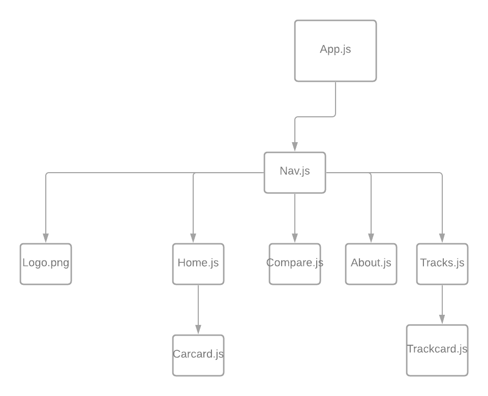
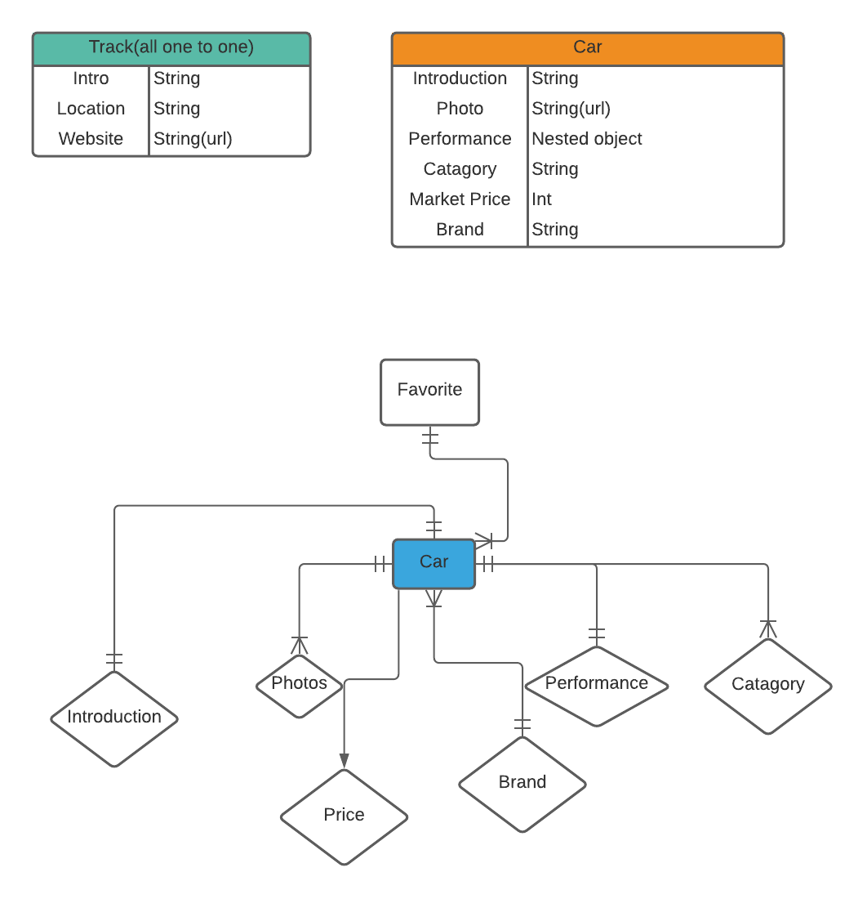
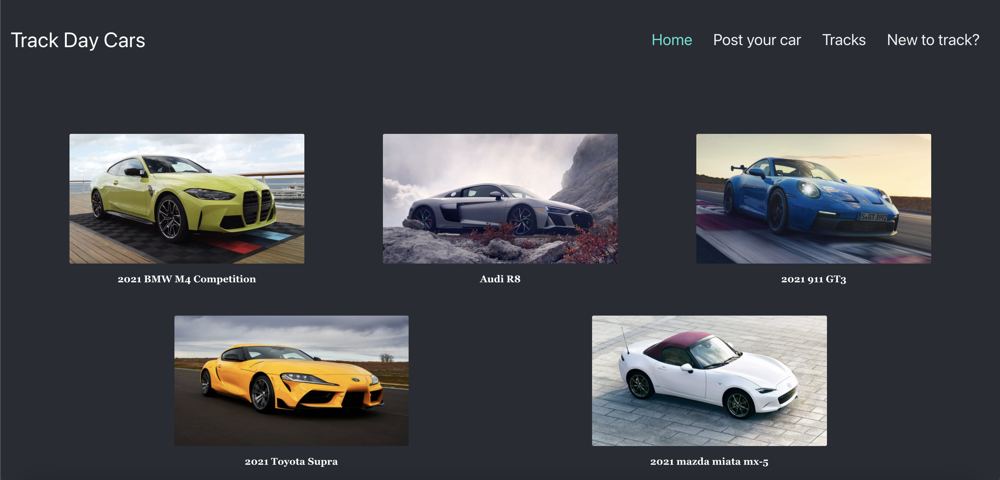

# TrackdayCar App

## Date: 08/27/2021

### By:Zitai Huang

[Trello](https://trello.com/b/Rk0PVwJ3/trackdaycarapp) |
[Github](https://github.com/Zitai01/TrackdayCar) |
[Linkedin](https://www.linkedin.com/in/zitai-huang/)
***
## **Description**

I was in a deep struggle wondering what car should I got when I was trying to buy a car that can be good on track and on public road. There are a lot of things to considerate when you are getting a car for the track, so I build this app in wish to help people getting the right track day car for their need!
***
## Getting started

Inside Home page you can find out all the sports car listed under the search bar, each car element should be clickable and direct to it's own page, if you find anycar you like , you can add it to the compare page, there you can compare all the cars you added to see the difference, finally you might find some race tracks near you in the tracks page.
***

## Frondend ERD

***
## Database ERD

***
## Technologies used
React.js , Node.js , Express.js,MongoDB
,Mongoose,CSS,Javascript,HTML.
***

## homepage screenshot

***
## MVP

- Be a new repo. Create a new repo in your github and build your project there. DO NOT name your repository Project 2, give it a real name.
- Have a separate directory for the frontend (client) and have your backend within the main repository.
- Include a beautiful, professional README.md (use markdown)
- Your README should have your name, links to socials, a detailed description of your project, technologies used, a getting started section (with links to your deployed site and Trello), screenshots of your final product (no more than 2-3), future updates, and credits.
- Utilize flexbox or grid (or both)
- Include a minimum of 2 Mongoose Schemas (models)
- Have (POST, GET, DELETE) operations
- Display data from each model on the frontend (unless given an exemption on one by an Instructor)
- Must be able to navigate between different pages (React Router)
- Have at least 40 meaningful git commits. You should be committing your changes every time you build a new feature.
- Your code should be properly indented, spaced, and within code blocks. DO NOT leave in commented out code that was left unused (bad practice). Comments should be in your code to describe what your functions are doing.
Be deployed on Heroku

## Additional objective

If all the objective listed before is reached and I some extra time, here is some feature I may add.

* Give every car a score on each direction.
* A couple filter in home.js to filter the carcard for client.
* Import other APIs to pefects the app.
* User login and add users to database.

## Thanks

